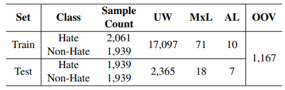
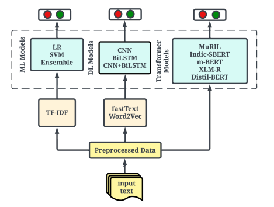
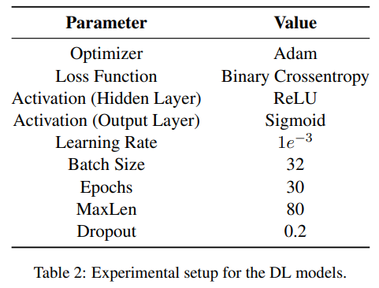
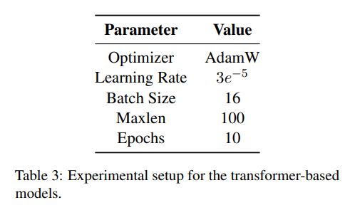
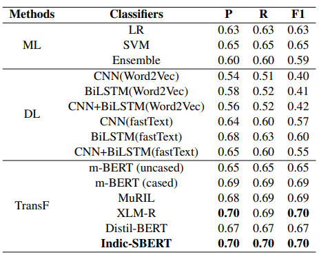
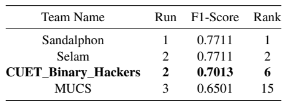

## CUET_Binary_Hackers@DravidianLangTech EACL2024: Hate and Offensive Language Detection in Telugu Code-Mixed Text Using Sentence Similarity BERT

**Author:** Salman Farsi, Asrarul Hoque Eusha, Jawad Hossain, Shawly Ahsan, Avishek Das and Mohammed Moshiul Hoque

**Paper:** [Paper in ACL Anthology](https://aclanthology.org/2024.dravidianlangtech-1.32/)

**Venue:** [DravidianLangTech-2024](https://sites.google.com/view/dravidianlangtech-2024/)

## Abstract

With the continuous evolution of technology and widespread internet access, various social media platforms have gained immense popularity, attracting a vast number of active users globally. However, this surge in online activity has also led to a concerning trend by driving many individuals to resort to posting hateful and offensive comments or posts, publicly targeting groups or individuals. In response to these challenges, we participated in this shared task. Our approach involved proposing a fine-tuning-based pre-trained transformer model to effectively discern whether a given text contains offensive content that propagates hatred. We conducted comprehensive experiments, exploring various machine learning (LR, SVM, and Ensemble), deep learning (CNN, BiLSTM, CNN+BiLSTM), and transformer-based models (Indic-SBERT, m-BERT, MuRIL, Distil-BERT, XLM-R), adhering to a meticulous fine-tuning methodology. Among the models evaluated, our fine-tuned L3Cube-Indic-Sentence-Similarity-BERT or Indic-SBERT model demonstrated superior performance, achieving a macro-average F1-score of 0.7013. This notable result positioned us at the $6^{th}$ place in the task.


## Contribution

- We explored different ML, DL, and transformer-based models for hate speech detection. And boosted the model's performance by determining the optimal hyper-parameters. 
- Contributed to the field by conducting a comprehensive comparison of different models and evaluating the performance of these models.

## Dataset Analysis

The dataset consists of Telugu code-mixed text sourced from social media. It is a binary classification task, with labels indicating whether the text is hateful/offensive or not. Table 1 represents the amount of data in each class according to the train-validation-test set.



## Methodology

We explored various machine learning (ML), deep learning (DL), and transformer-based models, including:

- **ML Models**: Logistic Regression (LR), Support Vector Machine (SVM), and Ensemble techniques.
- **DL Models**: Convolutional Neural Network (CNN), Bidirectional Long Short Term Memory (BiLSTM), and a combination of CNN and BiLSTM.
- **Transformer-based Models**: Indic-SBERT, m-BERT, MuRIL, Distil-BERT, and XLM-R.

Figure 1 shows a schematic diagram of the methodology.



Hyperparameters of different models are summarized in the following tables.




## Result and Analysis

Our fine-tuned Indic-SBERT model achieved a macro-average F1-score of 0.7013. Detailed results and analysis are available in the paper.



A brief ranking of participating teams is shown in Table 5.




## Error Analysis

After evaluating our model's performance, we conducted an error analysis to identify areas for improvement. We observed that:


- **Ambiguous Contexts**: The model occasionally struggled with sentences where the context was ambiguous, leading to incorrect classifications of non-offensive text as offensive.
- **Sarcasm and Irony**: Sarcasm and ironic statements were particularly challenging for the model, often resulting in false positives.
- **Code-Mixing Complexity**: The presence of code-mixing, especially when mixed with English phrases, sometimes confused the model, affecting its accuracy.
- **Dataset Imbalance**: A slight imbalance in the dataset may have contributed to the model's difficulty in correctly identifying less frequent classes.

These insights highlight the need for further fine-tuning and potentially incorporating more sophisticated techniques to handle complex linguistic phenomena in code-mixed text.

## Cite this work
If you find this repository helpful in your work please cite the following
```
@inproceedings{farsi-etal-2024-cuet-binary-hackers,
    title = "{CUET}{\_}{B}inary{\_}{H}ackers@{D}ravidian{L}ang{T}ech {EACL}2024: Hate and Offensive Language Detection in {T}elugu Code-Mixed Text Using Sentence Similarity {BERT}",
    author = "Farsi, Salman  and
      Eusha, Asrarul  and
      Hossain, Jawad  and
      Ahsan, Shawly  and
      Das, Avishek  and
      Hoque, Mohammed Moshiul",
    editor = "Chakravarthi, Bharathi Raja  and
      Priyadharshini, Ruba  and
      Madasamy, Anand Kumar  and
      Thavareesan, Sajeetha  and
      Sherly, Elizabeth  and
      Nadarajan, Rajeswari  and
      Ravikiran, Manikandan",
    booktitle = "Proceedings of the Fourth Workshop on Speech, Vision, and Language Technologies for Dravidian Languages",
    month = mar,
    year = "2024",
    address = "St. Julian's, Malta",
    publisher = "Association for Computational Linguistics",
    url = "https://aclanthology.org/2024.dravidianlangtech-1.32",
    pages = "193--199",
    abstract = "With the continuous evolution of technology and widespread internet access, various social media platforms have gained immense popularity, attracting a vast number of active users globally. However, this surge in online activity has also led to a concerning trend by driving many individuals to resort to posting hateful and offensive comments or posts, publicly targeting groups or individuals. In response to these challenges, we participated in this shared task. Our approach involved proposing a fine-tuning-based pre-trained transformer model to effectively discern whether a given text contains offensive content that propagates hatred. We conducted comprehensive experiments, exploring various machine learning (LR, SVM, and Ensemble), deep learning (CNN, BiLSTM, CNN+BiLSTM), and transformer-based models (Indic-SBERT, m- BERT, MuRIL, Distil-BERT, XLM-R), adhering to a meticulous fine-tuning methodology. Among the models evaluated, our fine-tuned L3Cube-Indic-Sentence-Similarity- BERT or Indic-SBERT model demonstrated superior performance, achieving a macro-average F1-score of 0.7013. This notable result positioned us at the 6th place in the task. The implementation details of the task will be found in the GitHub repository.",
}

```

## Note
`If you find any anomaly or have any query/suggestion feel free to ping.`
